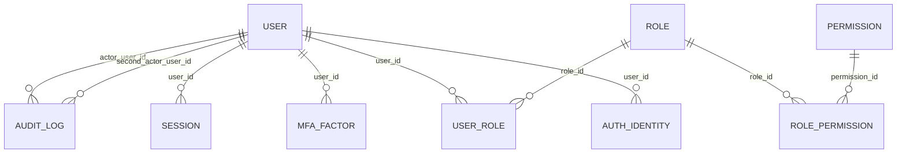
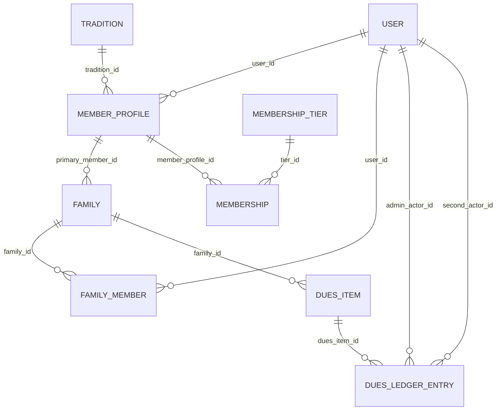
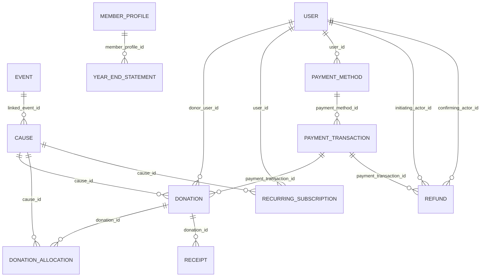
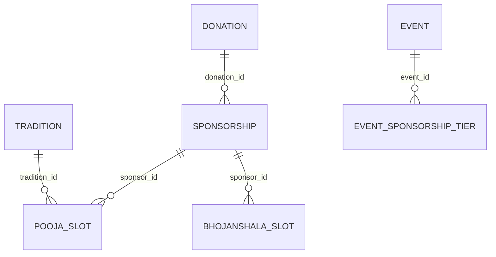
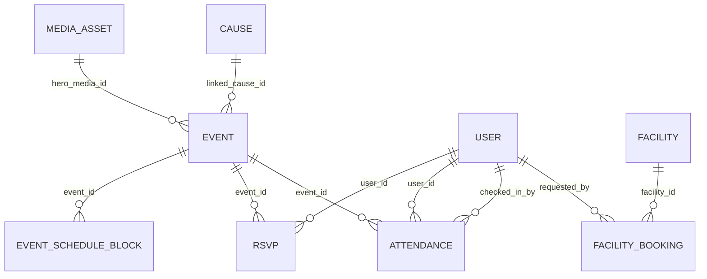
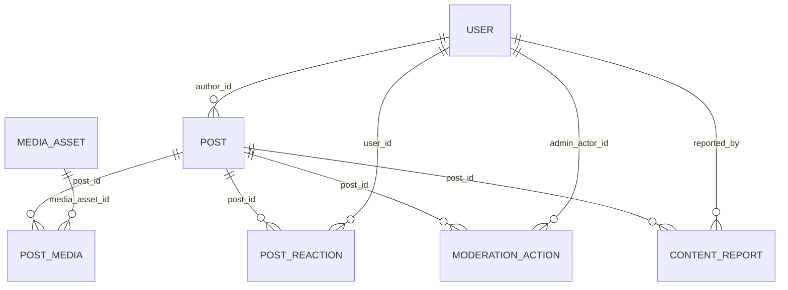
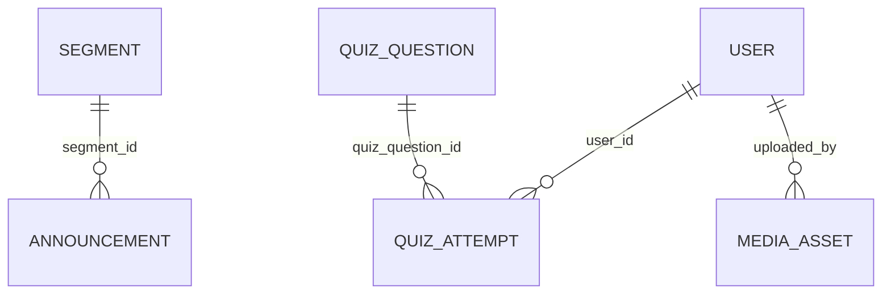
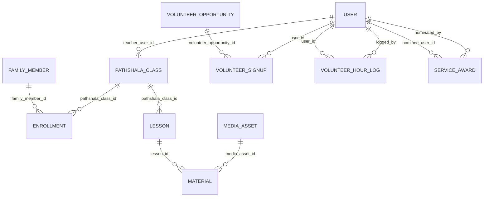
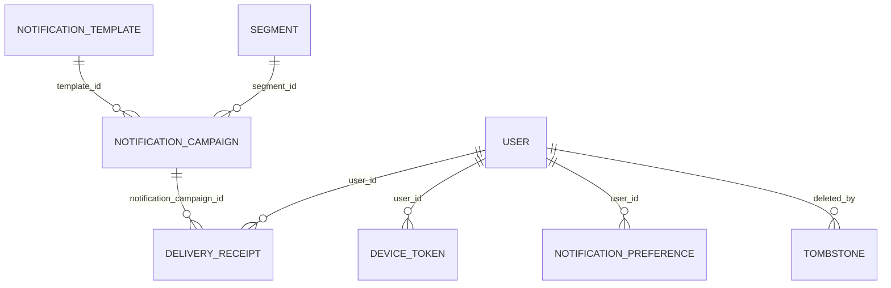

# Database Schema

Organized into nine domains. Every table carries these cross-cutting
conventions unless noted otherwise:

- UUID primary key
- `created_at`, `updated_at`, `created_by`, `updated_by`
- `deleted_at` (soft-delete tombstone; RFP §4.4.1 — 30-day recovery window)
- `version` (integer, optimistic locking; RFP §4.4.1 — multi-admin safety)
- An `audit_log` entry on every INSERT/UPDATE/DELETE originating from the admin utility

## Identity & Access

| Table | Purpose | Key Columns | Foreign Keys | Phase |
|---|---|---|---|---|
| `user` | One record per real person — the single source of identity RFP §3.1 requires. | email, phone, display_name, preferred_locale, status | — | phase0 |
| `auth_identity` | Linked external identity per sign-in method (Apple, Google, email/password). | provider, provider_subject_id, user_id | user_id -> user | phase0 |
| `mfa_factor` | Registered MFA factors — mandatory for admin, optional for members. | user_id, factor_type, secret_ref, verified_at | user_id -> user | phase0 |
| `role` | The role catalog: Guest, Member, Family Primary, Pathshala Parent, Committee Member, Admin, Super-Admin, plus any Vendor-proposed additions. | name, description | — | phase0 |
| `permission` | Granular per-section permission catalog (read / write / approve / money) per admin section. | section, action | — | phase0 |
| `role_permission` | Role-to-permission grants, with per-record override support. | role_id, permission_id, scope_override | role_id -> role, permission_id -> permission | phase0 |
| `user_role` | User-to-role assignment, many-to-many (a Committee Member can also be a Family Primary). | user_id, role_id | user_id -> user, role_id -> role | phase0 |
| `session` | Active session per device/surface, backing HttpOnly/Secure/SameSite web cookies and mobile refresh tokens. | user_id, surface, device_info, expires_at, revoked_at | user_id -> user | phase0 |
| `audit_log` | Immutable, append-only log of every state-changing operation. Retained seven years. Never updated or deleted by application code. | actor_user_id, action_type, target_table, target_id, before_state, after_state, second_actor_user_id | actor_user_id -> user, second_actor_user_id -> user (nullable, two-person rule) | phase0 |

## Membership

| Table | Purpose | Key Columns | Foreign Keys | Phase |
|---|---|---|---|---|
| `member_profile` | Member-specific fields layered on user — member ID, gotra, tradition affiliation. | user_id, member_id, tradition_id, gotra, joined_date | user_id -> user, tradition_id -> tradition | phase0 |
| `tradition` | The five Jain traditions housed at JCA — used everywhere equal-visibility is required (Live Darshan, Calendar, religious content). | name (Shvetambara Murtipujak, Shvetambara Sthanakvasi, Shvetambara Terapanthi, Digambar, Shrimad Rajchandra) | — | phase0 |
| `family` | One family record grouping related members. | family_name, primary_member_id | primary_member_id -> member_profile | phase1 |
| `family_member` | Individual within a family — includes non-user children too young to have accounts. | family_id, relationship, dob, gotra, has_user_account | family_id -> family, user_id -> user (nullable) | phase1 |
| `membership_tier` | Tier catalog (e.g. Standard, Patron, Lifetime) with pricing and renewal rules. | name, annual_price, is_lifetime | — | phase1 |
| `membership` | A member's current tier, since-date, and renewal date. | member_profile_id, tier_id, since_date, renewal_date, status | member_profile_id -> member_profile, tier_id -> membership_tier | phase1 |
| `dues_item` | A single billable line (annual membership, MJK pass, Pathshala term fee). | family_id, item_type, description, amount, due_date | family_id -> family | phase1 |
| `dues_ledger_entry` | Ledger of dues issued / paid / comped / waived / refunded, running balance. | dues_item_id, entry_type, amount, admin_actor_id, second_actor_id | dues_item_id -> dues_item, admin_actor_id -> user, second_actor_id -> user (nullable) | phase1 |

## Giving

| Table | Purpose | Key Columns | Foreign Keys | Phase |
|---|---|---|---|---|
| `cause` | A giving cause (General, Maintenance, Bhojanshala, Pathshala, Jeev Daya, Restoration if confirmed active). | name, description, goal_amount, raised_amount, is_active, linked_event_id | linked_event_id -> event (nullable, for event-based prioritization) | phase1 |
| `donation` | A single donation transaction (one-time). | cause_id, donor_user_id, amount, is_anonymous, memorial_text, payment_transaction_id | cause_id -> cause, donor_user_id -> user (nullable if off-platform), payment_transaction_id -> payment_transaction | phase1 |
| `donation_allocation` | Supports a donation split across multiple causes or an event-tied goal. | donation_id, cause_id, amount | donation_id -> donation, cause_id -> cause | phase1 |
| `recurring_subscription` | A recurring giving plan — daily aarti dāna, monthly general fund, yearly Paryushan dāna. | user_id, cause_id, amount, frequency, next_charge_date, status, stripe_subscription_id | user_id -> user, cause_id -> cause | phase1 |
| `payment_method` | Saved payment method reference — tokenized only, never a raw card number (PCI). | user_id, provider, provider_payment_method_id, brand, last4 | user_id -> user | phase1 |
| `payment_transaction` | Provider-agnostic transaction record — one row per Stripe or PayPal charge attempt. | provider, provider_transaction_id, amount, currency, status, idempotency_key | payment_method_id -> payment_method (nullable) | phase1 |
| `refund` | A refund against a payment_transaction — requires two admin actors per the money rule. | payment_transaction_id, amount, reason, initiating_actor_id, confirming_actor_id | payment_transaction_id -> payment_transaction, initiating_actor_id -> user, confirming_actor_id -> user | phase1 |
| `receipt` | Generated 501(c)(3) tax receipt PDF for a donation, including JCA EIN and required disclosure language. | donation_id, pdf_url, issued_at | donation_id -> donation | phase1 |
| `year_end_statement` | Consolidated annual giving statement per member, and institution-wide for admin reporting. | member_profile_id, tax_year, pdf_url, generated_at | member_profile_id -> member_profile | phase1 |

## Sponsorship

| Table | Purpose | Key Columns | Foreign Keys | Phase |
|---|---|---|---|---|
| `sponsorship` | A sponsorship record generalized across Tithi, Pooja/Abhishek, Bhojanshala, and event sponsorship. | sponsorship_type, target_id, donation_id, is_anonymous, memorial_text | donation_id -> donation | phase1 |
| `tithi_slot` | A sponsorable tithi date on the calendar, per the Sponsor a Tithi flow. | tithi_date, tier, is_available | — | phase1 |
| `pooja_slot` | Daily pooja/abhishek slot, per tradition, sponsorable. | date, tradition_id, slot_time, sponsor_id, is_open | tradition_id -> tradition, sponsor_id -> sponsorship (nullable) | phase1 |
| `bhojanshala_slot` | A kitchen-calendar date with meal-type tiers (full lunch, sweet box, snack seva). | date, meal_tier, sponsor_id, meal_count | sponsor_id -> sponsorship (nullable) | phase1 |
| `event_sponsorship_tier` | Sponsorship tiers configured per event (e.g. Gold/Silver/Bronze swamivatsalya). | event_id, tier_name, amount, slots_available | event_id -> event | phase1 |

## Events & Facilities

| Table | Purpose | Key Columns | Foreign Keys | Phase |
|---|---|---|---|---|
| `event` | Unified event schema — Religious, Cultural, and Educational categories all share this table. | title, category, description, hero_media_id, rsvp_cap, linked_cause_id | hero_media_id -> media_asset, linked_cause_id -> cause (nullable) | phase1 |
| `event_category` | Category catalog (Religious / Cultural / Educational) — admin-managed. | name | — | phase1 |
| `event_schedule_block` | A time block within an event's full schedule (e.g. abhishek at 9am, snatra puja at 11am). | event_id, start_time, end_time, label | event_id -> event | phase1 |
| `rsvp` | A member's RSVP to an event, with waitlist support. | event_id, user_id, status (confirmed/waitlisted/cancelled), party_size | event_id -> event, user_id -> user | phase1 |
| `attendance` | Day-of check-in record — supports member-ID scan, name search, and walk-in capture. | event_id, user_id (nullable for walk-ins), checked_in_at, checked_in_by | event_id -> event, user_id -> user (nullable), checked_in_by -> user | phase1 |
| `facility` | A bookable facility (Main Hall, Upashray, Marble Lobby) with member-rate pricing. | name, capacity, member_rate, policy_text | — | phase1 |
| `facility_booking` | A hall reservation with approval workflow and deposit tracking. | facility_id, requested_by, date, status, deposit_amount, deposit_paid | facility_id -> facility, requested_by -> user | phase1 |

## Community

| Table | Purpose | Key Columns | Foreign Keys | Phase |
|---|---|---|---|---|
| `post` | A community feed post — admin announcement (auto-published) or member post (gated by moderation). | author_id, body, status (pending/approved/declined), pinned | author_id -> user | phase1 |
| `post_media` | Media attachments on a post. | post_id, media_asset_id | post_id -> post, media_asset_id -> media_asset | phase1 |
| `post_reaction` | A reaction on a post. | post_id, user_id, reaction_type | post_id -> post, user_id -> user | phase1 |
| `moderation_action` | Audit trail of every moderation decision (approve/decline/edit/flag) — feeds the immutable audit log. | post_id, admin_actor_id, action, reason | post_id -> post, admin_actor_id -> user | phase1 |
| `badge` | Badge catalog (Youth, Pathshala) assignable to users, shown on posts and profiles. | name, description | — | phase1 |
| `content_report` | A member-submitted report against a post, routed to the moderation queue. | post_id, reported_by, reason, status | post_id -> post, reported_by -> user | phase1 |

## Content

| Table | Purpose | Key Columns | Foreign Keys | Phase |
|---|---|---|---|---|
| `announcement` | Admin-authored announcement — pinned in feed, pushed to notifications on publish. | title, body, publish_at, unpublish_at, segment_id | segment_id -> segment (nullable) | phase1 |
| `thought_of_day` | Home dashboard's Thought of the Day content, one per date. | date, text, source_attribution | — | phase1 |
| `quiz_question` | Daily quiz question bank. | question_text, choices, correct_choice_index, active_date | — | phase1 |
| `quiz_attempt` | A member's daily quiz attempt, feeding the streak counter. | user_id, quiz_question_id, is_correct, attempted_at | user_id -> user, quiz_question_id -> quiz_question | phase1 |
| `news_article` | Curated long-form article, distinct from the real-time community feed. | title, body, category, published_at | — | phase1 |
| `newsletter_issue` | A newsletter issue with archive support. | issue_number, title, body, sent_at | — | phase1 |
| `page` | Static/lightly-dynamic CMS page (About Us, Contact, Help) with version control. | slug, title, body, version | — | phase1 |
| `faq` | FAQ entries with a managed taxonomy. | category, question, answer, sort_order | — | phase1 |
| `policy_doc` | JCA Policies — authored, versioned, published (Phase 2). | title, body, version, published_at | — | phase2 |
| `meeting_minute` | Board / Executive Committee / General Body meeting minutes — gated, searchable, PDF (Phase 2). | meeting_type, meeting_date, pdf_url, gated | — | phase2 |
| `media_asset` | Uploaded media (image, PDF, audio) stored in S3/CloudFront, referenced across many content types. | storage_url, mime_type, alt_text, uploaded_by | uploaded_by -> user | phase0 |

## Education & Seva

| Table | Purpose | Key Columns | Foreign Keys | Phase |
|---|---|---|---|---|
| `pathshala_class` | A Pathshala class with a term schedule and assigned teacher. | grade_level, term_id, teacher_user_id, schedule | teacher_user_id -> user | phase1 |
| `enrollment` | A child's enrollment in a Pathshala class, with term-fee status. | family_member_id, pathshala_class_id, term_fee_status | family_member_id -> family_member, pathshala_class_id -> pathshala_class | phase1 |
| `lesson` | A lesson published to a class, with materials. | pathshala_class_id, title, lesson_date | pathshala_class_id -> pathshala_class | phase1 |
| `material` | Downloadable material attached to a lesson. | lesson_id, media_asset_id | lesson_id -> lesson, media_asset_id -> media_asset | phase1 |
| `volunteer_opportunity` | An open volunteer opportunity (Bhojanshala, Pathshala, Festival, Setup/Cleanup). | title, category, commitment, date, capacity | — | phase1 |
| `volunteer_signup` | A member's sign-up for an opportunity. | volunteer_opportunity_id, user_id, status | volunteer_opportunity_id -> volunteer_opportunity, user_id -> user | phase1 |
| `volunteer_hour_log` | Admin-entered hour log in v1.0; member self-entry deferred to Phase 2 consideration per RFP §3.4 item 10. | user_id, hours, logged_by, activity_date | user_id -> user, logged_by -> user | phase1 |
| `service_award` | Service Awards Program — nominations, recipients, eligibility (Phase 2). | nominee_user_id, nominated_by, status, award_year | nominee_user_id -> user, nominated_by -> user | phase2 |

## Platform Operations

| Table | Purpose | Key Columns | Foreign Keys | Phase |
|---|---|---|---|---|
| `notification_template` | Reusable templates for receipts, dues reminders, RSVP confirmations, sign-in alerts. | name, channel, subject, body_template | — | phase1 |
| `notification_campaign` | A composed, scheduled push/email send. | template_id, segment_id, scheduled_at, sent_at, status | template_id -> notification_template, segment_id -> segment | phase1 |
| `segment` | A saved recipient segment built from filter criteria (tab, tradition, family role, Pathshala enrollment, tier). | name, filter_definition (jsonb) | — | phase1 |
| `device_token` | Registered push token per device (APNs/FCM/Web Push). | user_id, platform, token, active | user_id -> user | phase1 |
| `delivery_receipt` | Per-notification, per-surface delivery metrics (sent/delivered/opened/bounced/opted-out). | notification_campaign_id, user_id, channel, status | notification_campaign_id -> notification_campaign, user_id -> user | phase1 |
| `notification_preference` | Per-member, per-category notification opt-in/opt-out (includes birthday/anniversary opt-in per family member). | user_id, category, channel, enabled | user_id -> user | phase1 |
| `feature_flag` | Feature-flag console backing — staff/committee/percentage/full rollout stages. | key, rollout_stage, rollout_percentage | — | phase1 |
| `localization_string` | Centralized translation catalog — one row per key/locale, per RFP §3.1. | key, locale, value, reviewed_by | — | phase0 |
| `integration_credential` | Encrypted-at-rest vault entry for payment/push/email/streaming/SSO credentials — Super-Admin only. | provider, credential_ref (AWS Secrets Manager pointer), rotated_at | — | phase0 |
| `tombstone` | Central index of soft-deleted records across all tables, backing the 30-day trash/recovery UI. | table_name, record_id, deleted_by, deleted_at, purge_at | deleted_by -> user | phase0 |

