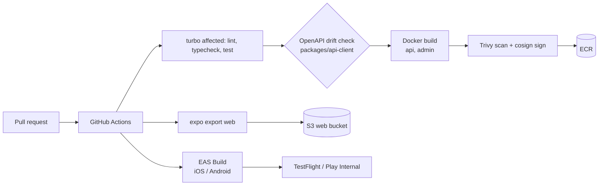
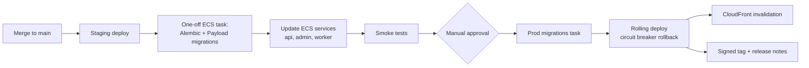
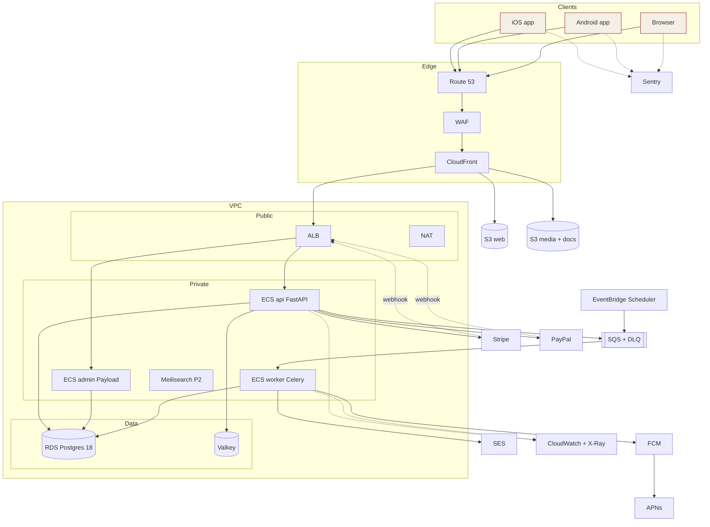
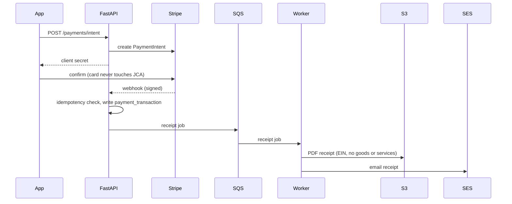
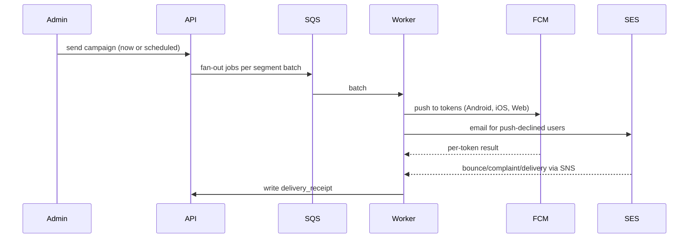

# AWS Architecture — Build to Deploy

**Status:** Draft v0.1, for iteration. Supersedes the GCP recommendation in `01-tech-decisions.md` ("Cloud hosting") once approved.
**Region (proposed):** `us-east-1` (JCA New York audience; widest service coverage).

---

## 1. Context and drivers

| Driver | Consequence for the architecture |
|---|---|
| Nonprofit, volunteer-run | Prefer managed services, no servers to patch, low fixed cost, scale down on quiet weekdays. |
| Festival peaks (Paryushan, Diwali, MJK) | Autoscaling Fargate, CloudFront caching for public pages, SQS to absorb bursts. |
| Money and 501(c)(3) receipts | PCI SAQ-A (card data never touches us), idempotent webhooks, immutable audit log, PDF receipts stored durably. |
| Admin MFA, two-person confirmation | Admin app isolated behind its own hostname and WAF rules. |
| WCAG 2.1 AA, elder devices | Fast first paint: pre-rendered public pages served from CloudFront. |
| One backend, one database | FastAPI and Payload share one RDS Postgres 18 instance in separate schemas. |

## 2. Confirmed stack

| Layer | Choice |
|---|---|
| Client | Expo (Router + React Native Web): iOS, Android, Web from one codebase |
| Admin / CMS | Payload CMS (Next.js, Postgres adapter) |
| API | FastAPI + SQLAlchemy 2 + Alembic + Pydantic |
| Database | PostgreSQL 18 (RDS) |
| Repo | Turborepo + pnpm: `apps/expo`, `apps/admin`, `packages/tokens`, `packages/ui`, `packages/api-client`, `services/api` |
| Compute | ECS Fargate |
| Queue | Celery on SQS; ElastiCache Valkey for cache, rate limits, presence |
| Email | Amazon SES |
| Push | FCM (Android, iOS via APNs, Web Push) |
| APM | CloudWatch + X-Ray (ADOT/OpenTelemetry) + Sentry |
| CI/CD | GitHub Actions with OIDC to AWS; EAS Build/Submit/Update for mobile |

## 3. Component inventory

| # | Component | Service | Purpose | Phase | Stories |
|---|---|---|---|---|---|
| **Edge** | | | | | |
| 1 | DNS | Route 53 | `jca.digitalbackoffice.co.uk` today (per `CNAME`); zones for `www`, `api`, `admin`, `media` | 0 | SETUP-4 |
| 2 | CDN | CloudFront (3 distributions: web, api, media) | Cache pre-rendered pages and media; TLS; origin shield optional | 1 | SEO-1 |
| 3 | Firewall | AWS WAF | Managed rule sets, rate limits on auth and donate, IP allow-list option for `admin.` | 1 | SEC |
| 4 | Certificates | ACM | TLS on CloudFront and ALB | 0 | SETUP-4 |
| **Web and admin** | | | | | |
| 5 | Public web | S3 (private, OAC) + CloudFront | `expo export` static/pre-rendered output | 1 | SEO-1 |
| 6 | Admin/CMS | ECS service `admin` (Payload) | Content and admin UI, `admin.` hostname | 1 | ADM-*, AUTH-4/5/6 |
| **Compute** | | | | | |
| 7 | API | ECS service `api` (FastAPI), min 2 tasks in prod | REST `/api/v1`, OpenAPI | 0 | API-1 |
| 8 | Worker | ECS service `worker` (Celery) | Notification fan-out, receipts, dunning, webhooks | 1 | NOT-1, PAY-5 |
| 9 | Scheduler | EventBridge Scheduler to SQS | Scheduled publish, dues reminders, year-end statements. Replaces a `beat` container | 1 | NOT-3, MFD |
| 10 | Load balancer | ALB (host-based routing: `api.`, `admin.`) | Health checks, TLS, WAF attach | 0 | SETUP-4 |
| 11 | Container registry | ECR (scan on push) | Signed, immutable image tags | 0 | SETUP-2 |
| **Data** | | | | | |
| 12 | Database | RDS Postgres 18, Multi-AZ in prod; `core` and `payload` schemas | System of record | 0 | DB-1/2 |
| 13 | Connection pooling | RDS Proxy | Protects DB from Fargate scale-out spikes | 1 | |
| 14 | Cache | ElastiCache Valkey | Cache, rate limits, admin presence and locks | 1 | GOV, COM-4 |
| 15 | Object storage | S3: `media`, `docs` (receipts, minutes, PDFs), `exports`; KMS; presigned uploads | Hero images, post media, PDFs | 1 | PAY-5, CN |
| 16 | Search | Postgres FTS (`pg_trgm`, `unaccent`); Meilisearch on Fargate + EFS | Admin/member search; library full-text | 1 / 2 | LIB-1 |
| 17 | Backups | RDS PITR + AWS Backup with cross-region copy | Recovery | 1 | GOV backup story |
| **Async** | | | | | |
| 18 | Queues | SQS: `notifications`, `receipts`, `webhooks`, `dunning`, each with a DLQ | Durable Celery broker | 1 | NOT-1 |
| **Messaging** | | | | | |
| 19 | Push | FCM via Firebase Admin SDK from workers; APNs auth key uploaded to Firebase; Web Push via FCM | One send path for all three surfaces | 1 | NOT-1/2 |
| 20 | Email | SES with configuration set; bounce/complaint/delivery events via SNS to an SQS consumer writing `delivery_receipt`; DKIM, SPF, DMARC | Receipts, verification, push-fallback, newsletter | 1 | NOT-1/5, CN-6 |
| **Payments** | | | | | |
| 21 | Cards, wallets, ACH, billing | Stripe (Payment Element, RN SDK, Billing) | Primary rail | 1 | PAY-1 |
| 22 | PayPal | PayPal Commerce | Secondary rail (RFP §4.1.3) | 1 | PAY-2 |
| | Webhooks | `api` endpoints, signature-verified, idempotency key in Postgres, work handed to SQS | Reliable money events | 1 | PAY-* |
| **Streaming** | | | | | |
| 23 | Live Darshan | Player only, JCA-supplied HLS URLs; CloudWatch Synthetics canary for health | Stream health panel | 1 | LD-1/4 |
| **Identity** | | | | | |
| 24 | Auth | JWT issued by FastAPI; Sign in with Apple, Google, email/password; Payload custom MFA | Keeps AUTH-1 as designed; Cognito not used | 0 | AUTH-1..6 |
| **Security** | | | | | |
| 25 | Secrets and keys | Secrets Manager, KMS | DB, Stripe, PayPal, FCM, SES credentials | 0 | GOV-6 |
| 26 | Network security | Private subnets, SGs, VPC endpoints (S3, SQS, ECR, Secrets Manager, Logs) | Reduce NAT cost and exposure | 0 | |
| 27 | Detection | CloudTrail, GuardDuty, Security Hub, Inspector | Audit and threat detection | 1 | SEC |
| **Observability** | | | | | |
| 28 | Traces and metrics | ADOT collector sidecar to X-Ray and CloudWatch | APM | 1 | |
| 29 | Logs | Structured JSON to CloudWatch Logs, retention set per group | | 1 | |
| 30 | Errors and crashes | Sentry (Expo with EAS source maps, Payload, FastAPI) | Crash and exception tracking | 1 | |
| 31 | Alerts | CloudWatch alarms to SNS to email/Slack; AWS Budgets | | 1 | |
| **Delivery** | | | | | |
| 32 | CI/CD | GitHub Actions, OIDC role per environment | See §6-7 | 0 | SETUP-1..5 |
| 33 | Mobile builds | EAS Build, Submit, Update | TestFlight, Play, OTA fixes | 0 | SETUP-3 |
| 34 | IaC | Terraform (S3 + DynamoDB state, or S3 native locking) | Identical staging and prod | 0 | SETUP-4 |
| **Phase 3** | | | | | |
| 35 | AI Chat (contingent) | Separate Fargate service, Amazon Bedrock (Claude), pgvector on RDS | Guardrailed assistant | 3 | AI-* |

## 4. Network topology

- One VPC per environment, 2 AZs.
- **Public subnets:** ALB, NAT gateway.
- **Private app subnets:** all Fargate tasks.
- **Isolated data subnets:** RDS, RDS Proxy, ElastiCache. No internet route.
- **Security-group chain:** ALB SG → app SG → data SG. Only the app SG may reach the data SG.
- **NAT:** one in staging, one per AZ in prod. VPC endpoints cut NAT traffic (S3, SQS, ECR, Secrets Manager, CloudWatch Logs). Outbound calls to Stripe, PayPal, FCM and SES still use NAT.

## 5. Environments and accounts

| | Dev/Staging account | Prod account |
|---|---|---|
| Purpose | Integration and pre-release | Live |
| RDS | Single-AZ, small | Multi-AZ, PITR, cross-region backup |
| Fargate | 1 task per service | `api` ≥ 2, `admin` ≥ 1, autoscaling |
| Access | Developers via SSO | Deploy roles only; break-glass audited |

Both come from the same Terraform modules with per-environment tfvars (replaces the GCP three-project plan in ARCH-4 and SETUP-4). Payload content is promoted staging to prod through a documented export/import step, not by sharing a database.

## 6. Build pipeline

- Mobile profiles in `eas.json`: `development`, `preview`, `production`. OTA text and content fixes go through EAS Update.
- Docker builds are reproducible: pinned base digests, locked dependencies.
- AWS access from Actions is through OIDC roles, with no stored AWS keys.

## 7. Deploy pipeline

Migrations run **before** the service update and must be backward compatible with the previous release (expand, then contract). CodeDeploy blue/green is an optional later upgrade.

## 8. Deployment overview

## 9. Key flows

### Donation

### Notification fan-out

### Media upload

Client requests a presigned S3 URL from the API (auth checked, size and type limited), uploads directly to S3, API records the asset, CloudFront serves it from the `media` distribution.

## 10. Resilience and DR

- Targets: **RPO ≤ 5 min** (RDS PITR), **RTO ≤ 4 h**.
- Multi-AZ RDS and Fargate across 2 AZs in prod.
- AWS Backup copies to a second region; S3 versioning on `docs`.
- Quarterly restore drill, feeding the Super-Admin backup/restore story.
- DLQ alarms: any message in a DLQ pages the on-call.

## 11. Cost sketch (order of magnitude, to be validated)

| Item | Staging | Prod |
|---|---|---|
| Fargate (api, admin, worker) | ~$40 | ~$150-250 |
| RDS Postgres (+ Multi-AZ prod) | ~$30 | ~$120-200 |
| ElastiCache | ~$15 | ~$30-60 |
| NAT / ALB / WAF | ~$50 | ~$120-180 |
| CloudFront, S3, SQS, SES, logs | ~$10 | ~$30-80 |
| **Total** | **~$150** | **~$450-800** |

Sentry, EAS and Firebase have free or low tiers to start. Apply for nonprofit credits (TechSoup AWS credits, AWS Imagine Grant) since this is roughly in line with what the GCP plan assumed from Google for Nonprofits.

## 12. Decision log

| Decision | Case for | Case against and mitigation |
|---|---|---|
| **AWS over GCP** | Board or team preference; broad managed-service set; same Terraform pattern | Loses Google for Nonprofits credits. Mitigate with AWS nonprofit credits. |
| **Fargate** | No servers, per-service scaling, runs all four workloads uniformly | Costlier than EC2 at steady state. Fine at this scale. |
| **SES** | Cheapest, in-AWS, events via SNS | Sandbox exit request and reputation warm-up needed; template tooling is basic (templates live in Payload). |
| **FCM for all push** | One API, free, per-token status, covers Web Push | Dependency on Google. iOS requires APNs key in Firebase. |
| **SQS + Celery** | Durable, DLQ, cheap | Celery/SQS lacks some features (no result backend, limited monitoring). Results stored in Postgres; Flower not used. |
| **EventBridge Scheduler over Celery beat** | No single-instance scheduler to keep alive | Two places define jobs. Keep the schedule list in Terraform. |
| **CloudWatch + X-Ray + Sentry** | Cheap, AWS-native, Sentry for mobile crashes | X-Ray UX is basic. OTel keeps a later move to Grafana/Datadog easy. |
| **No Cognito** | Keeps the AUTH-1 design and one identity across services | We own token handling. |
| **GitHub Actions + OIDC** | Repo already on GitHub, no long-lived keys | Pipeline logic lives outside AWS. |

## 13. Open questions for the next iteration

1. **Expo web rendering:** static/pre-rendered (S3 + CloudFront, cheapest) or server output (needs a Fargate SSR service)? Recommended: static for Phase 1 public pages.
2. **Region:** `us-east-1` confirmed?
3. **Accounts:** two accounts (staging, prod) or three (dev, staging, prod)?
4. **HLS encoder:** does JCA have one? If not, MediaLive/IVS is a change order.
5. **Domain:** current `CNAME` is `jca.digitalbackoffice.co.uk`. Which production domain will own email DKIM and the `api.`/`admin.` hostnames?
6. **Availability level:** is Multi-AZ RDS in prod acceptable cost-wise, or single-AZ with PITR to start?
7. **Existing static site:** `index.html` and the other pages at the repo root are GitHub Pages prototypes. Retire them at cutover, or keep as fallback?
8. **Alerting channel:** Slack, email, or SMS/PagerDuty?

---

## 14. Image-generation prompt

### Full prompt

> Create a clean, professional **AWS cloud architecture diagram**, landscape 16:9, white background, in the style of official AWS reference architecture diagrams (official AWS service icons, thin rounded group boxes, small clear labels, arrows with arrowheads). Title at top: **"JCA Platform — AWS Architecture (Production)"**.
>
> **Layout, left to right:**
>
> 1. **Clients (far left):** three icons: iOS app, Android app, Web browser (labelled "Expo: one codebase").
> 2. **Edge (next column):** Amazon Route 53 → AWS WAF → Amazon CloudFront. CloudFront fans out to three origins: an S3 bucket "Public web (pre-rendered)", an S3 bucket "Media and documents", and the Application Load Balancer.
> 3. **AWS Region box, containing a VPC box spanning two Availability Zones (AZ-a, AZ-b):**
>    - **Public subnets:** Application Load Balancer and NAT Gateway.
>    - **Private app subnets (ECS Fargate cluster):** four service tiles: "api (FastAPI)", "admin (Payload CMS)", "worker (Celery)", and a faded dashed "Meilisearch (Phase 2)". Each has a small ADOT sidecar marker.
>    - **Isolated data subnets:** Amazon RDS for PostgreSQL 18 (Multi-AZ, primary and standby, with RDS Proxy), Amazon ElastiCache (Valkey).
>    - VPC endpoint markers for S3, SQS, ECR, Secrets Manager.
> 4. **Async and scheduling (below the Fargate group, inside the region):** Amazon SQS with a dead-letter queue, connected to the worker; Amazon EventBridge Scheduler feeding SQS.
> 5. **Messaging and payments (right column, outside AWS, labelled "External services"):** Firebase Cloud Messaging (with APNs beneath it, labelled "iOS + Web Push via FCM"), Amazon SES, Stripe, PayPal, and "HLS stream sources (JCA shrines)" feeding the client players.
> 6. **Security lane (thin band inside the region):** AWS Secrets Manager, AWS KMS, AWS IAM, Amazon GuardDuty, AWS CloudTrail, AWS Security Hub.
> 7. **Observability lane (bottom band):** Amazon CloudWatch (logs, metrics, alarms), AWS X-Ray, Amazon SNS to "Email / Slack alerts"; Sentry (external) receiving crash and error reports from the clients, api, and admin.
> 8. **CI/CD lane (top band):** GitHub repository (Turborepo monorepo) → GitHub Actions → (a) Amazon ECR → ECS deploy (with "Alembic + Payload migrations" one-off task before service update), (b) S3 web bucket sync + CloudFront invalidation, and (c) Expo EAS Build/Submit → TestFlight and Google Play, plus EAS Update (OTA) to the clients. Label the GitHub Actions to AWS link "OIDC (no stored keys)". Show separate "Staging account" and "Production account" boxes with the same pipeline promoting from staging to production through a "Manual approval" diamond.
>
> **Arrow conventions:** solid arrows for synchronous requests, dashed arrows for asynchronous/event flows (SQS, webhooks, SNS, telemetry). Label key arrows: "HTTPS", "presigned upload", "webhook (signed)", "push", "email", "traces/logs". Stripe and PayPal webhooks are dashed arrows into the ALB. SES bounce/complaint events return through SNS to the worker as a dashed arrow.
>
> **Style:** AWS orange/dark-navy palette for AWS elements; a subtle JCA crimson (#8c1c2b) accent only on the title underline and the client icons; external services in grey boxes. Include a small legend (solid vs dashed, AWS vs external, Phase 2 dashed-faded) at the bottom-right. Keep text legible, avoid overlapping lines, and align icons on a grid.

### Short prompt (for tools with length limits)

> Professional AWS reference-architecture diagram, 16:9, official AWS icons. Left to right: iOS / Android / Web clients → Route 53 → WAF → CloudFront → (S3 web, S3 media, ALB). Inside a VPC across two AZs: ALB and NAT in public subnets; ECS Fargate services api (FastAPI), admin (Payload CMS), worker (Celery) in private subnets; RDS PostgreSQL 18 Multi-AZ with RDS Proxy and ElastiCache in isolated subnets. SQS with DLQ and EventBridge Scheduler feed the worker. Worker sends push via Firebase Cloud Messaging (APNs) and email via Amazon SES; Stripe and PayPal webhooks (dashed) enter the ALB. Bottom lane: CloudWatch, X-Ray, SNS alerts, Sentry. Side lane: Secrets Manager, KMS, GuardDuty, CloudTrail. Top lane: GitHub → GitHub Actions (OIDC) → ECR → ECS deploy, S3 sync, and Expo EAS → TestFlight / Google Play. Solid arrows sync, dashed async, small legend.
