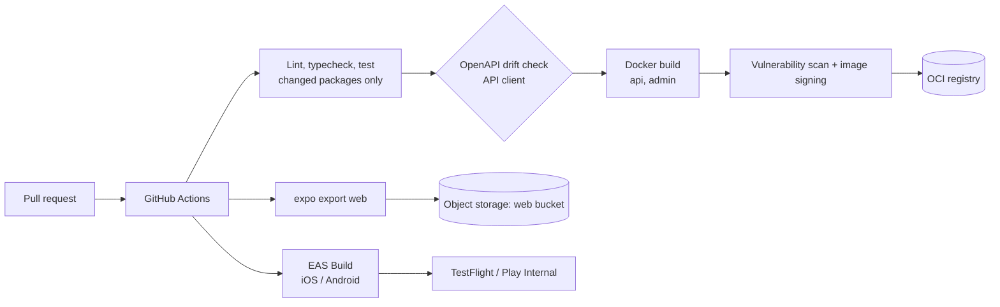
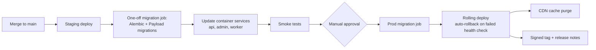
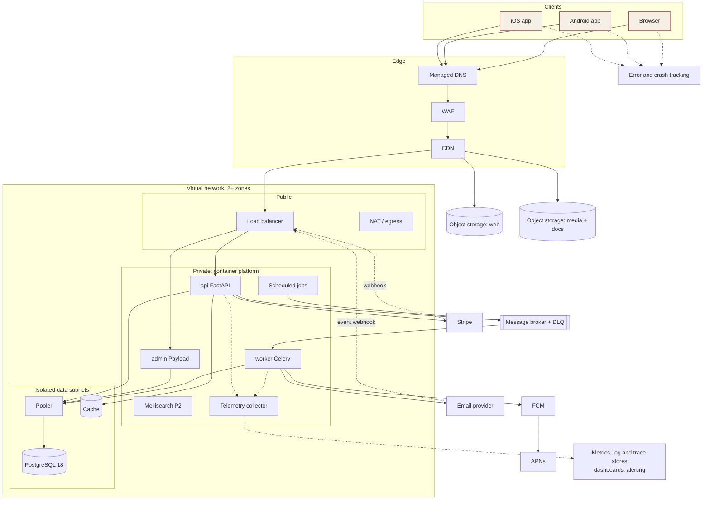
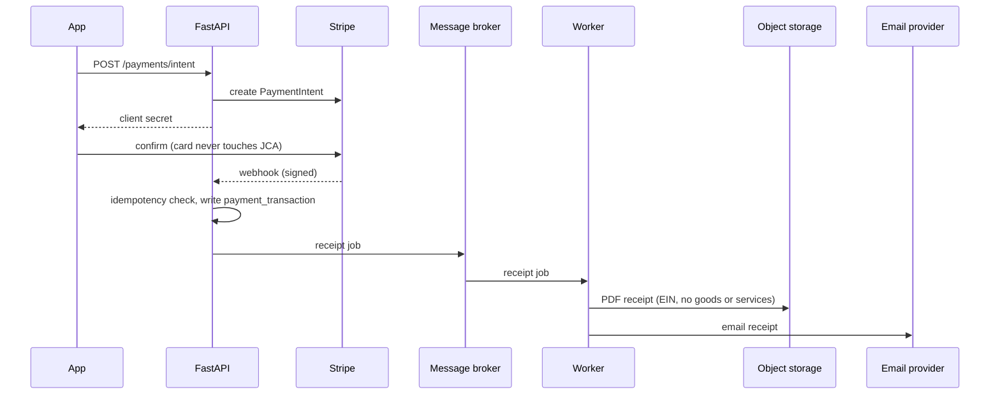
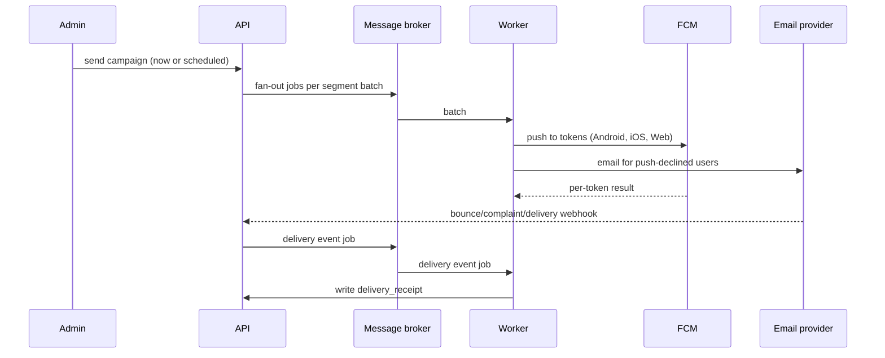

# JCA Platform

**Status:** Draft v0.2, for iteration. Cloud-agnostic architecture, build to deploy.
**Region (proposed):** a region near New York (JCA audience), in whichever cloud is chosen. It needs two or more availability zones and a second region for backups.

---

## 1. Context and drivers

| Driver | Consequence for the architecture |
|---|---|
| Nonprofit, volunteer-run | Prefer managed services, no servers to patch, low fixed cost, scale down on quiet weekdays. |
| Festival peaks (Paryushan, Diwali, MJK) | Container autoscaling, CDN caching for public pages, a message broker to absorb bursts. |
| Money and 501(c)(3) receipts | PCI SAQ-A (card data never touches us), idempotent webhooks, immutable audit log, PDF receipts stored durably. |
| Admin MFA, two-person confirmation | Admin app isolated behind its own hostname and WAF rules. |
| WCAG 2.1 AA, elder devices | Fast first paint: pre-rendered public pages served from the CDN. |
| One backend, one database | FastAPI and Payload share one managed PostgreSQL 18 instance in separate schemas. |
| **Portability** | Any cloud can host it. App code uses only open protocols and standards (PostgreSQL, S3-style object API, AMQP, Redis protocol, OTLP, OIDC, OCI images). Cloud-specific code lives only in the infrastructure platform layer. |

## 2. Confirmed stack

| Layer | Choice |
|---|---|
| Client | Expo (Router + React Native Web): iOS, Android, Web from one codebase |
| Admin / CMS | Payload CMS (Next.js, Postgres adapter) |
| API | FastAPI + SQLAlchemy 2 + Alembic + Pydantic |
| Database | PostgreSQL 18 (managed service) |
| Compute | OCI containers on a managed container platform |
| Queue | Celery on an AMQP message broker; Redis-protocol cache (Valkey) for cache, rate limits, presence |
| Email | Pluggable email provider behind an adapter (SMTP or HTTP API) |
| Push | FCM (Android, iOS via APNs, Web Push) |
| Observability | Open telemetry standard (OTLP) from every service to a telemetry collector; metrics, logs and traces stored in a managed or self-run backend; separate error and crash tracking service |
| CI/CD | GitHub Actions with OIDC federation to the cloud; EAS Build/Submit/Update for mobile |
| IaC | Terraform / OpenTofu, split into a per-cloud platform layer and a shared application layer |

## 3. Component inventory

| # | Component | Generic role | Purpose | Phase | Stories |
|---|---|---|---|---|---|
| **Edge** | | | | | |
| 1 | DNS | Managed DNS with automated records | `jca.digitalbackoffice.co.uk` today (per `CNAME`); zones for `www`, `api`, `admin`, `media` | 0 | SETUP-4 |
| 2 | CDN | CDN (3 distributions: web, api, media) | Cache pre-rendered pages and media; TLS; origin shield optional | 1 | SEO-1 |
| 3 | Firewall | WAF | Managed rule sets, rate limits on auth and donate, IP allow-list option for `admin.` | 1 | SEC |
| 4 | Certificates | Managed, auto-renewing TLS certificates | TLS on the CDN and load balancer | 0 | SETUP-4 |
| **Web and admin** | | | | | |
| 5 | Public web | Private object-storage bucket + CDN | `expo export` static/pre-rendered output | 1 | SEO-1 |
| 6 | Admin/CMS | Container service `admin` (Payload) | Content and admin UI, `admin.` hostname | 1 | ADM-*, AUTH-4/5/6 |
| **Compute** | | | | | |
| 7 | API | Container service `api` (FastAPI), min 2 instances in prod | REST `/api/v1`, OpenAPI | 0 | API-1 |
| 8 | Worker | Container service `worker` (Celery) | Notification fan-out, receipts, dunning, webhooks | 1 | NOT-1, PAY-5 |
| 9 | Scheduler | Scheduled container jobs publishing to the broker | Scheduled publish, dues reminders, year-end statements. Replaces a `beat` container | 1 | NOT-3, MFD |
| 10 | Load balancer | Application load balancer with host-based routing (`api.`, `admin.`) | Health checks, TLS, WAF attach | 0 | SETUP-4 |
| 11 | Container registry | OCI image registry (scan on push) | Signed, immutable image tags | 0 | SETUP-2 |
| **Data** | | | | | |
| 12 | Database | Managed PostgreSQL 18, high availability across zones in prod; `core` and `payload` schemas | System of record | 0 | DB-1/2 |
| 13 | Connection pooling | Connection pooler in front of the database | Protects the database from scale-out spikes | 1 | |
| 14 | Cache | Managed Redis-protocol cache (Valkey) | Cache, rate limits, admin presence and locks | 1 | GOV, COM-4 |
| 15 | Object storage | S3-compatible buckets: `media`, `docs` (receipts, minutes, PDFs), `exports`; managed-key encryption; presigned uploads | Hero images, post media, PDFs | 1 | PAY-5, CN |
| 16 | Search | Postgres full-text search (`pg_trgm`, `unaccent`); Meilisearch as a container service with persistent volume | Admin/member search; library full-text | 1 / 2 | LIB-1 |
| 17 | Backups | Database point-in-time recovery + scheduled snapshots with cross-region copy; volume and bucket backups | Recovery | 1 | GOV backup story |
| **Async** | | | | | |
| 18 | Queues | AMQP message broker: `notifications`, `receipts`, `webhooks`, `dunning`, each with a dead-letter queue | Durable Celery broker | 1 | NOT-1 |
| **Messaging** | | | | | |
| 19 | Push | FCM via Firebase Admin SDK from workers; APNs auth key uploaded to Firebase; Web Push via FCM | One send path for all three surfaces | 1 | NOT-1/2 |
| 20 | Email | Email provider adapter; delivery, bounce and complaint events arrive by webhook to a consumer writing `delivery_receipt`; DKIM, SPF, DMARC | Receipts, verification, push-fallback, newsletter | 1 | NOT-1/5, CN-6 |
| **Payments** | | | | | |
| 21 | Cards, wallets, PayPal, ACH, billing | Stripe as the single payment broker (Payment Element, RN SDK, Billing); PayPal offered as a Stripe payment method | Primary and only payment rail | 1 | PAY-1, PAY-2 |
| | Webhooks | `api` endpoints, signature-verified, idempotency key in Postgres, work handed to the broker | Reliable money events | 1 | PAY-* |
| **Streaming** | | | | | |
| 22 | Live Darshan | Player only, JCA-supplied HLS URLs; external synthetic uptime check | Stream health panel | 1 | LD-1/4 |
| **Identity** | | | | | |
| 23 | Auth | JWT issued by FastAPI; Sign in with Apple, Google, email/password; Payload custom MFA | Keeps AUTH-1 as designed; no cloud identity service | 0 | AUTH-1..6 |
| **Security** | | | | | |
| 24 | Secrets and keys | Secret manager + key management service, injected into services as environment variables | DB, Stripe, FCM, email credentials | 0 | GOV-6 |
| 25 | Network security | Private subnets, firewall rules, service-to-service network policies, private endpoints to managed services | Reduce egress cost and exposure | 0 | |
| 26 | Detection | Cloud audit log, threat detection, posture management, image vulnerability scanning | Audit and threat detection | 1 | SEC |
| **Observability** | | | | | |
| 27 | Traces and metrics | Telemetry collector next to each service, exporting over OTLP to the metrics and trace stores | APM | 1 | |
| 28 | Logs | Structured JSON to standard output, shipped to the log store, retention set per stream | | 1 | |
| 29 | Errors and crashes | Error and crash tracking service (mobile with source maps, admin, API) | Crash and exception tracking | 1 | |
| 30 | Alerts | Alerting service to email/Slack; budget alerts | | 1 | |
| **Delivery** | | | | | |
| 31 | CI/CD | GitHub Actions, OIDC identity per environment | See §7-8 | 0 | SETUP-1..5 |
| 32 | Mobile builds | EAS Build, Submit, Update | TestFlight, Play, OTA fixes | 0 | SETUP-3 |
| 33 | IaC | Terraform / OpenTofu with remote state and locking; platform layer per cloud + shared application layer | Identical staging and prod | 0 | SETUP-4 |
| **Phase 3** | | | | | |
| 34 | AI Chat (contingent) | Separate container service, LLM API behind an adapter, pgvector on Postgres | Guardrailed assistant | 3 | AI-* |

## 4. Portability rules

1. **Open protocols only in app code.** PostgreSQL wire protocol, S3-style object API (configurable endpoint), AMQP, Redis protocol, OTLP, OIDC, OCI images, SMTP/HTTPS.
2. **Adapters for the rest.** Email, push, LLM and secret retrieval sit behind small interfaces in `services/api/adapters/`. No cloud-specific SDK imports outside that folder.
3. **Twelve-factor config.** Everything comes from environment variables injected at deploy time. No hard-coded endpoints.
4. **Two infrastructure layers.**
   - **Platform layer, one module per cloud:** network, container platform, managed PostgreSQL, cache, object storage, DNS, CDN, WAF, key management, secrets, image registry.
   - **Application layer, shared:** container service definitions, scheduled jobs, load-balancer routes, network policies. Identical across clouds.
   - Every platform module exports the same outputs (database URL, bucket names, registry URL, cluster endpoint) so the application layer does not change.
5. **Exit test.** A new cloud counts as supported when its platform module passes the shared, cloud-independent smoke-test suite (§8).

## 5. Network topology

- One virtual network per environment, 2 or more availability zones.
- **Public subnets:** load balancer, NAT / egress gateway.
- **Private app subnets:** all container services.
- **Isolated data subnets:** managed PostgreSQL, pooler, cache. No internet route.
- **Traffic chain:** load balancer → app services → data. Firewall rules allow only the app subnet to reach the data subnet. Network policies deny service-to-service traffic by default and allow only what is needed.
- **Private endpoints** for object storage, image registry, secret manager and log store where the cloud supports them. Outbound calls to Stripe, FCM and the email provider use NAT.
- One NAT in staging, one per zone in prod.

## 6. Environments and accounts

| | Dev/Staging (separate account, project or subscription) | Prod (separate account, project or subscription) |
|---|---|---|
| Purpose | Integration and pre-release | Live |
| Database | Single-zone, small | High availability across zones, PITR, cross-region backup |
| Services | 1 instance each | `api` ≥ 2, `admin` ≥ 1, autoscaling |
| Access | Developers via SSO | Deploy identities only; break-glass audited |

Both come from the same infrastructure modules with per-environment variable files. Payload content is promoted staging to prod through a documented export/import step, not by sharing a database.

## 7. Build pipeline

- Mobile profiles in `eas.json`: `development`, `preview`, `production`. OTA text and content fixes go through EAS Update.
- Docker builds are reproducible: pinned base digests, locked dependencies.
- Cloud access from Actions is through OIDC federation, with no stored cloud keys.

## 8. Deploy pipeline

Migrations run **before** the service update and must be backward compatible with the previous release (expand, then contract). Blue/green releases are an optional later upgrade. The smoke-test suite is cloud-independent and doubles as the acceptance test for a new platform module.

## 9. Deployment overview

## 10. Key flows

### Donation

### Notification fan-out

### Media upload

Client requests a presigned object-storage URL from the API (auth checked, size and type limited), uploads directly to the bucket, API records the asset, and the CDN serves it from the `media` distribution.

## 11. Resilience and DR

- Targets: **RPO ≤ 5 min** (database point-in-time recovery), **RTO ≤ 4 h**.
- High-availability PostgreSQL and container services spread across 2 or more zones in prod, with a minimum number of healthy instances kept during updates.
- Database and bucket backups copied to a second region; object versioning on `docs`; backups of persistent volumes.
- Quarterly restore drill, feeding the Super-Admin backup/restore story.
- Dead-letter queue alarms: any message in a dead-letter queue pages the on-call.
- Because the stack is portable, the DR runbook can include a "restore into another cloud" path (database dump, bucket sync, platform module, application layer). Treat it as a stretch goal, not a Phase 1 target.

## 12. Cost sketch (order of magnitude, to be validated, varies by provider)

| Item | Staging | Prod |
|---|---|---|
| Container compute (api, admin, worker, broker) | ~$60-90 | ~$200-350 |
| Managed PostgreSQL (+ high availability in prod) | ~$30 | ~$120-200 |
| Cache | ~$15 | ~$30-60 |
| Load balancer / NAT / WAF | ~$50 | ~$120-180 |
| Container platform management fee | ~$70 | ~$70-150 |
| CDN, object storage, email, logs | ~$10 | ~$30-80 |
| **Total** | **~$200-250** | **~$550-1,000** |

Running on a container platform carries a modest premium over a fully serverless setup, in exchange for portability. The error tracking, EAS and Firebase services have free or low tiers to start. Apply for the nonprofit credit program of whichever cloud is chosen.

## 13. Decision log

| Decision | Case for | Case against and mitigation |
|---|---|---|
| **Container platform as the common runtime** | Same images and service definitions on every cloud; no lock-in to a proprietary compute service | More operational surface than serverless. Mitigate with managed platform modes and a small number of services. |
| **Managed services behind open protocols** | Low ops burden, yet replaceable (PostgreSQL, Redis protocol, S3-style API) | Some managed features differ per cloud. Keep to the common subset and test in the shared smoke suite. |
| **AMQP broker over cloud-specific queues** | Same broker everywhere, dead-letter queues built in, works with Celery | We run it, or use a managed offering where available. Use persistent storage and replicated queues. |
| **Scheduled container jobs over Celery beat or cloud schedulers** | No single-instance scheduler; cloud-neutral | Job definitions live in the application layer. Keep one schedule list in the repo. |
| **Email behind an adapter** | Swap providers per cloud or sender reputation | Sandbox exit and warm-up per provider; templates live in Payload so they are portable. |
| **FCM for all push** | One API, free, per-token status, covers Web Push | Dependency on Google. iOS requires an APNs key in Firebase. |
| **Open telemetry standard, swappable backend** | Vendor-neutral traces, metrics and logs; the backend can change without code changes | A self-run backend adds work. Alternative: send OTLP to a hosted observability service. |
| **Stripe as the single payment broker** | One SDK, one webhook path, one reconciliation source; PayPal is covered as a Stripe payment method | PayPal availability depends on Stripe support and region. Confirm it is enabled on the US nonprofit account before launch. |
| **No managed identity service** | Keeps the AUTH-1 design and one identity across clouds | We own token handling. |
| **GitHub Actions + OIDC** | Repo already on GitHub, no long-lived keys, all major clouds support OIDC federation | Pipeline logic lives outside the cloud. |
| **Platform / application layer split** | Cloud-specific code is isolated; adding a cloud means one new platform module | Duplicate effort per cloud. Build only the module for the cloud actually chosen, and keep the output contract documented. |

## 14. Open questions for the next iteration

1. **Which cloud first?** Pick one for launch (credits, board preference); the others stay "supported by design".
2. **Container platform or simpler container hosting for Phase 1?** Recommended: managed container platform in its managed-node mode if the team accepts the learning curve; otherwise start on simpler container hosting and move later (images and adapters stay valid).
3. **Expo web rendering:** static/pre-rendered (object storage + CDN, cheapest) or server output (needs an SSR service)? Recommended: static for Phase 1 public pages.
4. **Region:** which region is closest to New York in the chosen cloud?
5. **Accounts:** two environments (staging, prod) or three (dev, staging, prod)?
6. **HLS encoder:** does JCA have one? If not, a managed live-streaming service is a change order.
7. **Domain:** current `CNAME` is `jca.digitalbackoffice.co.uk`. Which production domain will own email DKIM and the `api.`/`admin.` hostnames?
8. **Availability level:** is high-availability PostgreSQL in prod acceptable cost-wise, or single-zone with PITR to start?
9. **Existing static site:** `index.html` and the other pages at the repo root are GitHub Pages prototypes. Retire them at cutover, or keep as fallback?
10. **Alerting channel:** Slack, email, or SMS/PagerDuty?
11. **Message broker:** self-run on the container platform or a managed offering?

---

## 15. Image-generation prompt

### Full prompt

> Create a clean, professional **vendor-neutral cloud architecture diagram**, landscape 16:9, white background, in the style of a reference architecture (generic technology icons: container box, database cylinder, bucket, queue, shield for WAF, globe for CDN; **no cloud-vendor logos**), thin rounded group boxes, small clear labels, arrows with arrowheads. Title at top: **"JCA Platform"**, with a thin crimson underline.
>
> **Layout, left to right:**
>
> 1. **Clients (far left):** three icons: iOS app, Android app, Web browser (labelled "Expo: one codebase").
> 2. **Edge (next column):** Managed DNS → WAF → CDN. The CDN fans out to three origins: an object-storage bucket "Public web (pre-rendered)", an object-storage bucket "Media and documents", and the Load Balancer.
> 3. **Cloud Region box, containing a Virtual Network box spanning two Availability Zones (Zone A, Zone B):**
>    - **Public subnets:** Load Balancer (host-based routing) and NAT / egress gateway.
>    - **Private app subnets (container platform):** four container-service tiles: "api (FastAPI)", "admin (Payload CMS)", "worker (Celery)", and a faded dashed "Meilisearch (Phase 2)". Add a "Scheduled jobs" tile and a small "Telemetry collector" marker.
>    - **Isolated data subnets:** Managed PostgreSQL 18 (high availability, primary and standby, with a Pooler), Managed Cache (Redis protocol).
>    - Private endpoint markers for object storage, image registry, and secret manager.
> 4. **Async and scheduling (below the container group, inside the region):** Message broker with a dead-letter queue, connected to the worker; Scheduled jobs feeding the broker.
> 5. **Messaging and payments (right column, outside the cloud, labelled "External services"):** Firebase Cloud Messaging (with APNs beneath it, labelled "iOS + Web Push via FCM"), "Email provider (adapter)", "Stripe (cards, wallets, PayPal, ACH)", and "HLS stream sources (JCA shrines)" feeding the client players.
> 6. **Security lane (thin band inside the region):** Secret Manager, Key Management, Identity and access (OIDC federation), Threat detection, Audit log, Image vulnerability scanning.
> 7. **Observability lane (bottom band):** Telemetry collector → Metrics store, Log store, Trace store → Dashboards, Alerting to "Email / Slack alerts"; an "Error and crash tracking" service (external) receiving reports from the clients, api, and admin.
> 8. **CI/CD lane (top band):** GitHub repository → GitHub Actions → (a) OCI image registry → container service deploy (with an "Alembic + Payload migrations" one-off job before the service update), (b) object-storage web bucket sync + CDN cache purge, and (c) Expo EAS Build/Submit → TestFlight and Google Play, plus EAS Update (OTA) to the clients. Label the GitHub Actions to cloud link "OIDC federation (no stored keys)". Show separate "Staging environment" and "Production environment" boxes with the same pipeline promoting from staging to production through a "Manual approval" diamond.
>
> **Arrow conventions:** solid arrows for synchronous requests, dashed arrows for asynchronous/event flows (broker, webhooks, telemetry). Label key arrows: "HTTPS", "presigned upload", "webhook (signed)", "push", "email", "OTLP traces/logs". Stripe and email-provider event webhooks are dashed arrows into the Load Balancer.
>
> **Style:** neutral dark-slate and teal palette for platform elements; a subtle JCA crimson (#8c1c2b) accent only on the title underline and the client icons; external services in grey boxes. Include a small legend (solid vs dashed, platform vs external, Phase 2 dashed-faded) at the bottom-right. Keep text legible, avoid overlapping lines, and align icons on a grid.

### Short prompt (for tools with length limits)

> Professional vendor-neutral cloud reference-architecture diagram, 16:9, generic icons, no cloud-vendor logos, title "JCA Platform". Left to right: iOS / Android / Web clients → Managed DNS → WAF → CDN → (object-storage web bucket, object-storage media bucket, Load Balancer). Inside a virtual network across two zones: Load Balancer and NAT in public subnets; container platform with api (FastAPI), admin (Payload CMS), worker (Celery), scheduled jobs in private subnets; managed PostgreSQL 18 with high availability and pooler, plus managed cache, in isolated subnets. Message broker with dead-letter queue feeds the worker. Worker sends push via Firebase Cloud Messaging (APNs) and email via a pluggable email provider; Stripe and email-provider webhooks (dashed) enter the load balancer. Bottom lane: telemetry collector → metrics, log and trace stores → dashboards, alerting; error and crash tracking. Side lane: secret manager, key management, audit log, threat detection. Top lane: GitHub → GitHub Actions (OIDC) → OCI registry → container deploy, object-storage sync, and Expo EAS → TestFlight / Google Play. Solid arrows sync, dashed async, small legend.
